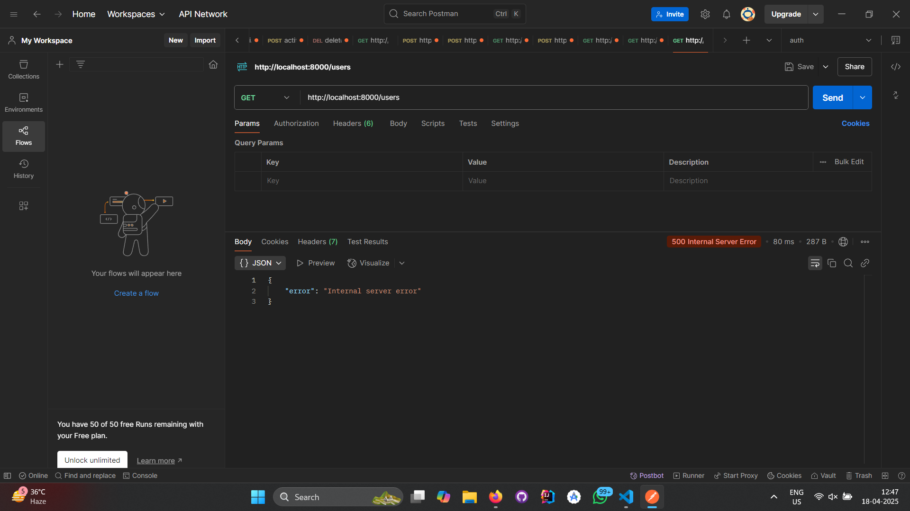
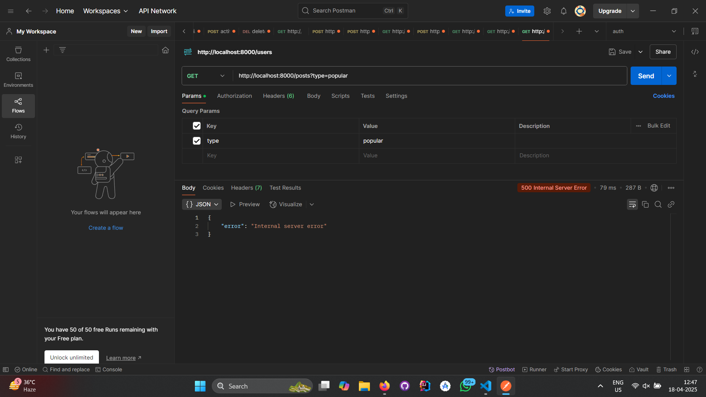

# 📊 Social Media Analytics Backend Microservice

This is the backend microservice developed for the **Social Media Analytics** problem. It fetches data from a test social media server and exposes APIs for frontend consumption.

---

## 🧩 Features

- Fetches and processes data from the provided evaluation-service server.
- Caches post and comment data efficiently for real-time analytics.
- Exposes custom APIs:
  - `GET /users` - Top 5 users with most commented posts.
  - `GET /posts?type=popular` - Most commented post(s).
  - `GET /posts?type=latest` - Latest 5 posts in real-time.

---

## 🏁 How to Run

```bash
npm install
npm run dev
```

Server will start on `http://localhost:8000` by default.

---

## 🧪 API Endpoints and Output

### 1. `GET /users`

Returns the top 5 users with the most commented posts.

**Postman Screenshot:**


---

### 2. `GET /posts?type=popular`

Returns post(s) with the most number of comments.

**Postman Screenshot:**


---

### 3. `GET /posts?type=latest`

Returns the latest 5 posts.

**Postman Screenshot:**


---

## ⚠️ Error Notice from Test Server

When attempting to fetch data from the test server using the endpoint:

```
GET http://20.244.56.144/evaluation-service/users
```

🔒 **Note:** This error is from the test server and not due to our backend implementation.

**Screenshot of error:**


---

```
GET http://20.244.56.144/evaluation-service/users/1/posts
```

🔒 **Note:** This error is from the test server and not due to our backend implementation.

**Screenshot of error:**


---

```
GET http://20.244.56.144/evaluation-service/posts/150/comments
```

🔒 **Note:** This error is from the test server and not due to our backend implementation.

**Screenshot of error:**


---